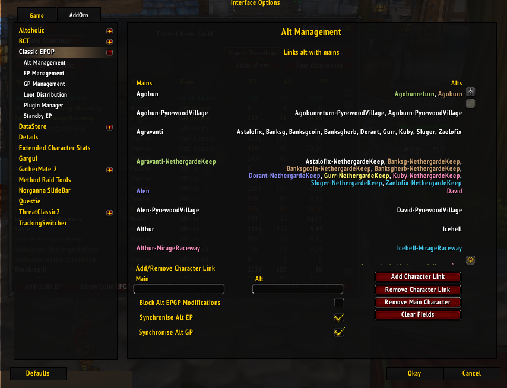
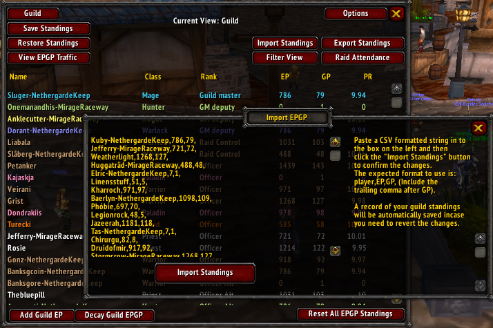

To do a calculation:

1) Download the code from here:
https://github.com/CalinOana/epgp/archive/refs/heads/master.zip

2) Unzip the archive

3) Exports:
* Export as csv from https://vanilla.warcraftlogs.com/guild/attendance/638722#zone=2005:
  
  to :
  [aq40attendance.csv](aq40attendance.csv) (**remove first line with header**)

* Export as csv from https://vanilla.warcraftlogs.com/guild/attendance/638722#zone=2006
  to:
  [naxxattendance.csv](naxxattendance.csv) (**remove first line with header**)

* Export as csv from /grm audit -> Export tool -> Members -> Select checkboxes as in image -> Export selection -> Export
  next x :
  
  to:
  [alts.csv](alts.csv) (exporter only exports 500 at a time so you have to paste 2 times, **also remove first line with header**)

* Export as csv from https://thatsmybis.com/15620/social-guild/export/loot/csv/wishlist to:
  [naxxWishlistItemsReceived.csv](naxxWishlistItemsReceived.csv) (**remove first line with header**)

4) Open a console where you unzipped  (if you don't know how to navigate the console see here https://www.computerhope.com/issues/chusedos.htm)
5) Copy paste command :
**./mvnw spring-boot:run** (linux) or **.\mvnw spring-boot:run**  (windows command prompt)
6) If program was successfull you should have 2 files in exports folder,
   *   [exports/epGpStandings.csv](exports/epGpStandings.csv)
   *   [exports/guildMainAltMapping.txt](exports/guildMainAltMapping.txt)
9) To import main-alts: 
     * Close the game 
    * Go to C:\Program Files (x86)\World of Warcraft\_classic_era_\WTF\Account\404993666#1\SavedVariables\CEPGP.lua
     * Copy-paste inside the ["Links"] = { **copy_paste_location**} variable what is in the [exports/guildMainAltMapping.txt](exports/guildMainAltMapping.txt)
     * Save file, start game and you should have the alts in /cepgp options ->alt management as follows :
7)  Remove first line and last comma from       [exports/epGpStandings.csv](exports/epGpStandings.csv)
    before importing
8) Import standings  in game by typing /cepgp show -> options- > improt standings and copy-pasting the [exports/epGpStandings.csv](exports/epGpStandings.csv)
    file
   

