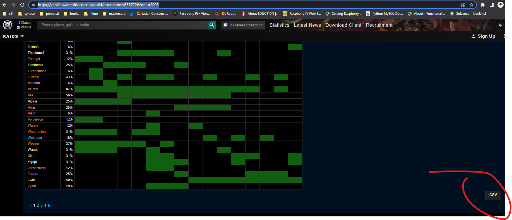
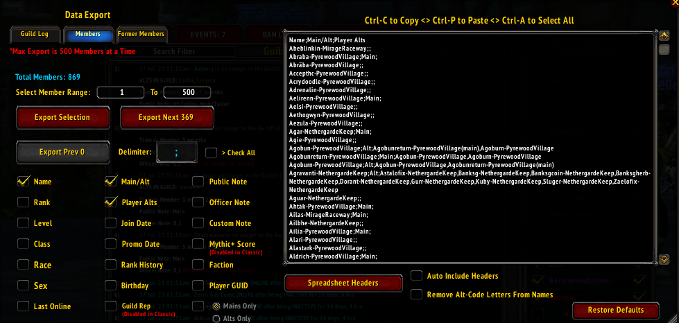

To do a calculation:

Download the code from here:
https://github.com/CalinOana/epgp/archive/refs/heads/master.zip
Unzip the archive

* Export as csv from https://vanilla.warcraftlogs.com/guild/attendance/638722#zone=2005:
  
  to :
  [aq40attendance.csv](aq40attendance.csv) (**remove first line with header**)

* Export as csv from https://vanilla.warcraftlogs.com/guild/attendance/638722#zone=2006
  to:
  [naxxattendance.csv](naxxattendance.csv) (**remove first line with header**)

* Export as csv from /grm audit -> Export tool -> Members -> Select checkboxes as in image -> Export selection -> Export
  next x :
  
  to:
  [alts.csv](alts.csv) (exporter only exports 500 at a time so you have to paste 2 times)

* Export as csv from https://thatsmybis.com/15620/social-guild/export/loot/csv/wishlist to:
  [naxxWishlistItemsReceived.csv](naxxWishlistItemsReceived.csv) (**remove first line with header**)

Open a console where you unzipped  
Copy paste command :
./mvnw spring-boot:run
